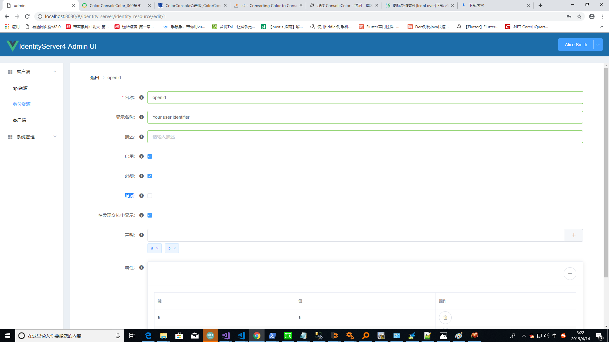
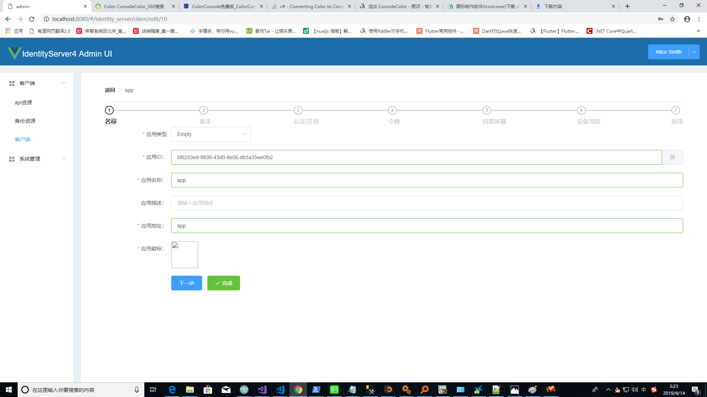
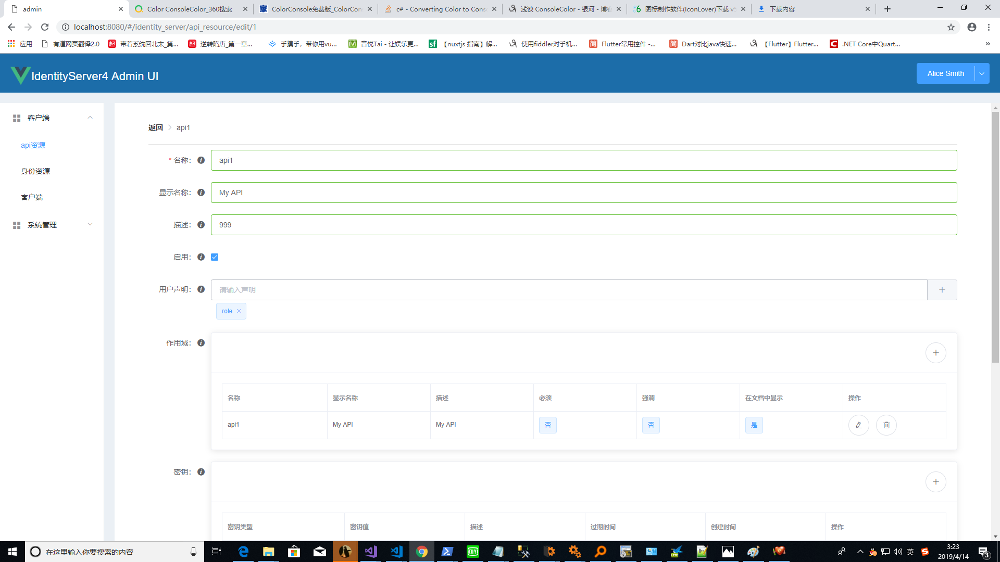

# IdentityServer4.AdminUI
IdentityServer4 AdminUI

# 开发技术
    前端：vue + element ui
    后端：AutoMapper + NHibernate + FluentValidation
# 使用方法
    ui:

    cd src/admin
    npm install 
    npm run dev

    server:

    cd src/Tiantianquan.Admin.Server
    dotnet run

    admin api:

    cd src/Tiantianquan.Admin.Web
    dotnet run

# 界面预览

# 欢迎大家参与开发
    代码写的比较乱，只完成了一部分，尚未完全完成，希望有人一起开发。
    联系：460247986@qq.com
